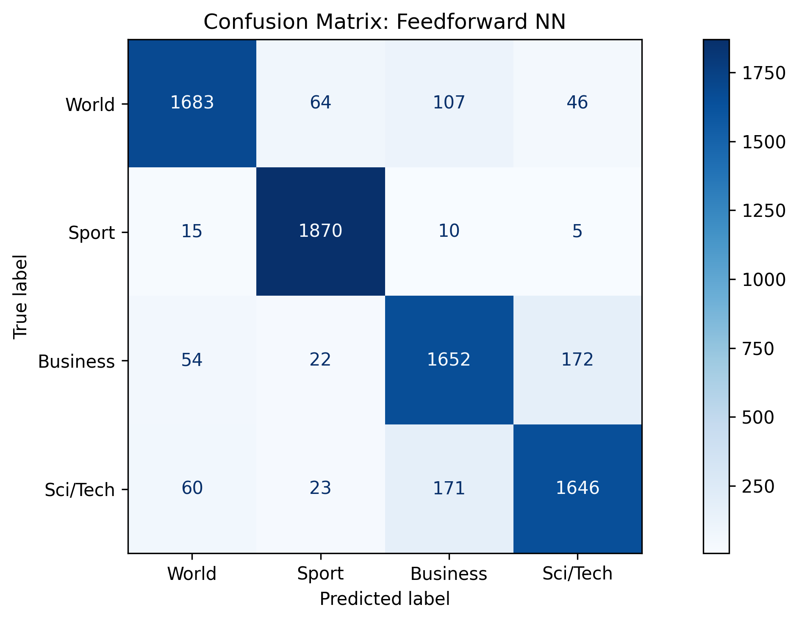
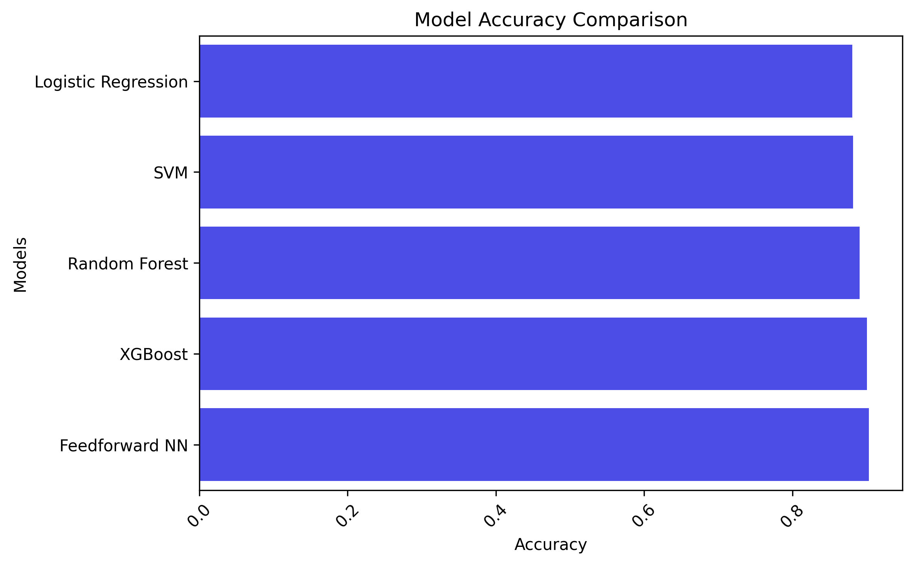

## 📰 News Category Classification
This project is a **Natural Language Processing (NLP)** application that classifies news articles into multiple categories such as World, Sport, Business, and Sci/Tech.

## 🧩 Key Steps:
- Data Cleaning: Tokenization, stopword removal, lemmatization, et.c
- Feature Extraction: Represented text using pre-trained **Gensim word embeddings** for better understanding of meaning.
- Model Training: Trained and compared multiple models:
  - **Logistic Regression** 
  - **Support Vector Machine (SVM)**
  - **Random Forest Classifier**
  - **XGBoost Classifier**
  - **Feedforward Neural Network (Keras)**
- Visualization: Generated word clouds and confusion matrices for both models.
- Evaluation: Measured performance using accuracy, classification reports.

## 📂 Dataset
The dataset used is the AG News Classification Dataset (120,000+ samples).
- Available on:
  - [Kaggle - AG News Classification Dataset](https://www.kaggle.com/datasets/amananandrai/ag-news-classification-dataset)
  - [Google Drive - AG News Classification Dataset](https://drive.google.com/drive/folders/19_Vm_xGfmJyAxbAOMPpAMwokGYztSSQd?usp=drive_link)

## 📊 Visualizations
- WordClouds showing the most frequent words across categories
- Confusion Matrix for the best Models
- Comparison of model accuracies

### WordClouds


### Confusion Matrix


### Model Comparison


### 📊 Model Performance Comparison
| Model | Accuracy | Remarks |
|:---------------------------|:----------:|:----------------------|
| Logistic Regression | 88.06% | — |
| Support Vector Machine (SVM) | 88.21% | — |
| Random Forest Classifier | 89.09% | — |
| XGBoost Classifier | 90.07% | — |
| **Feedforward Neural Network (Keras)** | **90.28%** | 🏆 Best performance |

## 🧠 Tech Stack & Tools: 
- Python (NumPy, Pandas, Matplotlib, Seaborn, WordCloud, BeautifulSoup, NLTK, Gensim, Scikit-learn, Xgboost, Tensorflow)
- GitHub / Google Colab / Kaggle → for collaboration and experimentation

## 📦 Dependencies
Before running this project locally, ensure the following are installed:
- Python 3.x
- NumPy
- Pandas
- Matplotlib
- Seaborn
- WordCloud
- BeautifulSoup4
- NLTK
- Gensim
- Scikit-learn
- Xgboost
- Tensorflow
- SciKeras

## Installing
To install all required dependencies:
```sh
pip install -r requirements.txt
```

## 💡 Features
- Clean and preprocess raw text data
- Use semantic word embeddings for better context understanding
- Train multiple ML and DL models for comparison
- Visualize model metrics and word distributions

## 📂 Folder Structure
```
News-Category-Classification/
├── News-Category-Classification.ipynb          
├── requirements.txt     
├── images/              
│   ├── ...             
└── README.md          
```

## ❓ Help
If you encounter any issues:
- Search for similar issues or solutions on [Kaggle](https://www.kaggle.com/)
- Open an issue in this repository

## ✍️ Author
👤 Oluyale Ezekiel
- 📧 Email: ezekieloluyale@gmail.com
- LinkedIn: [Ezekiel Oluyale](https://www.linkedin.com/in/ezekiel-oluyale)
- GitHub: [@amusEcode1](https://github.com/amusEcode1)
- Twitter: [@amusEcode1](https://x.com/amusEcode1?t=uHxhLzrA1TShRiSMrYZQiQ&s=09)

## 🙏 Acknowledgement
Thank you, Elevvo, for the incredible opportunity and amazing Internship.
